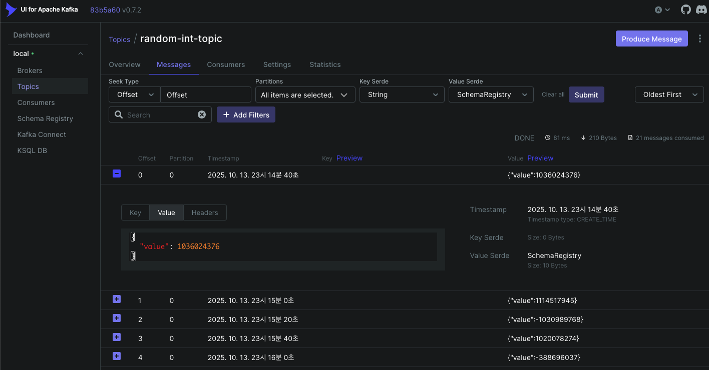
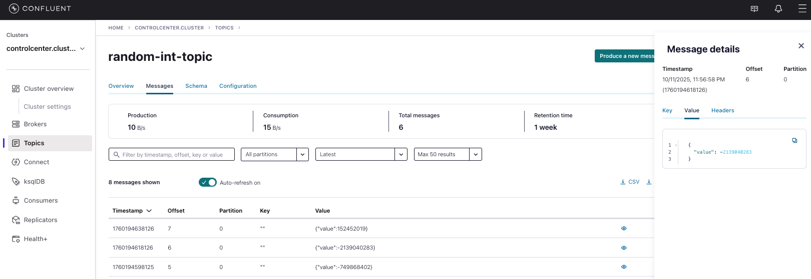

# kafka-all-in-one
A simple Apache Kafka environment with Kafka Connect, Schema Registry, ksqlDB, Kafka UI, MySQL, and PostgreSQL using Docker Compose.

### Run and check the environment
```bash
# Confluent(Kafka): 8.1.0(4.1.x, 2025.10.15), 8.0.2(4.0.x), 7.9.3(3.9.x), 7.8.2(3.8.x)
# Debezium(Kafka):  3.3.0(4.1.x, 2025.09.02), 3.2.3(4.0.x), 3.1.3(3.9.x)

# start containers (Add the -f docker-compose-full.yml option to create a sample connector automatically)
docker compose up

# connect to MySQL
docker exec -it mysql mysql -umyuser -pmyuser_pw123! -Dmysqldb

mysql> select * from products;
+-----+-------------+-----------------------+--------+--------+---------------------+
| id  | name        | description           | weight | price  | create_at           |
+-----+-------------+-----------------------+--------+--------+---------------------+
| 101 | scooter     | Small 2-wheel scooter |   3.14 | 10.224 | 2025-10-16 20:12:33 |
| 102 | car battery | 12V car battery       |    8.1 | 11.224 | 2025-10-16 20:12:33 |
...
9 rows in set (0.000 sec)

mysql> exit;

# connect to PostgreSQL
docker exec -it postgres psql -U pguser -d pgdb

pgdb=# select * from products_out;
 id | name | description | weight | price | create_at 
----+------+-------------+--------+-------+-----------
(0 rows)

pgdb=# \q
```

### Check available connectors
```bash
# connect to connect container
docker exec -it -u root connect bash

# curl
microdnf install -y dnf && dnf install -y jq

curl connect:8083/connector-plugins | jq .
[
  {
    "class": "com.hibuz.kafka.connect.examples.RandomSourceConnector",
    "type": "source",
    "version": "1.0.0"
  },
  {
    "class": "io.confluent.connect.jdbc.JdbcSinkConnector",
    "type": "sink",
    "version": "10.8.4"
  },
  {
    "class": "io.confluent.connect.jdbc.JdbcSourceConnector",
    "type": "source",
    "version": "10.8.4"
  },
  {
    "class": "io.confluent.kafka.connect.datagen.DatagenConnector",
    "type": "source",
    "version": "null"
  },
  {
    "class": "io.debezium.connector.mysql.MySqlConnector",
    "type": "source",
    "version": "3.3.0.Final"
  },
  {
    "class": "io.debezium.connector.postgresql.PostgresConnector",
    "type": "source",
    "version": "3.3.0.Final"
  },
  {
    "class": "org.apache.kafka.connect.mirror.MirrorCheckpointConnector",
    "type": "source",
    "version": "8.0.0-ccs"
  },
  {
    "class": "org.apache.kafka.connect.mirror.MirrorHeartbeatConnector",
    "type": "source",
    "version": "8.0.0-ccs"
  },
  {
    "class": "org.apache.kafka.connect.mirror.MirrorSourceConnector",
    "type": "source",
    "version": "8.0.0-ccs"
  }
]
```

### Create mysql source connector
```bash
# create a sample MySQL source connector
curl -X POST -H "Content-Type: application/json" -d @/connectors/mysqldb-source-connector.json http://connect:8083/connectors

# check connector status
curl -X GET -H "Accept:application/json" localhost:8083/connectors/mysqldb-source-connector/status | jq .
{
  "name": "mysqldb-source-connector",
  "connector": {
    "state": "RUNNING",
    "worker_id": "connect:8083"
  },
  "tasks": [
    {
      "id": 0,
      "state": "RUNNING",
      "worker_id": "connect:8083"
    }
  ],
  "type": "source"
}

```

### Create pgsql sink connector
```bash
# create a sample PostgreSQL sink connector
curl -X POST -H "Content-Type: application/json" -d @/connectors/pgdb-sink-connector.json http://connect:8083/connectors

# check connector status
curl -X GET -H "Accept:application/json" localhost:8083/connectors/pgdb-sink-connector/status | jq .
{
  "name": "pgdb-sink-connector",
  "connector": {
    "state": "RUNNING",
    "worker_id": "connect:8083"
  },
  "tasks": [
    {
      "id": 0,
      "state": "RUNNING",
      "worker_id": "connect:8083"
    }
  ],
  "type": "sink"
}

# connect and update a record in MySQL to see the change data capture (CDC) in action
mysql> UPDATE products SET description='Large 2-wheel scooter', price=12.345, create_at=now() WHERE id=101;
Query OK, 1 row affected (0.003 sec)
Rows matched: 1  Changed: 1  Warnings: 0

# connect and query PostgreSQL to see the data replicated from MySQL
pgdb=# select * from products_out;
```


## Visit 
- Kafka UI: http://localhost:8989

- Control Center UI: http://localhost:9021 (full version only)


### Stops containers and removes containers, networks, and volumes created by `compose up`.
```bash
docker compose down -v
[+] Running 11/11
 ✔ Container kafka-all-in-one-kafka-init-topics-1  Removed
 ✔ Container postgres                              Removed
 ✔ Container mysql                                 Removed
 ✔ Container kafka-ui                              Removed
 ✔ Container ksqldb-server                         Removed
 ✔ Container connect                               Removed
 ✔ Container schema-registry                       Removed
 ✔ Container broker                                Removed
 ✔ Volume kafka-all-in-one_mysql-vol               Removed
 ✔ Volume kafka-all-in-one_pg-vol                  Removed
 ✔ Network kafka-all-in-one_default                Removed
```

## References
* https://github.com/confluentinc/cp-all-in-one
* https://github.com/provectus/kafka-ui
* https://github.com/enfuse/kafka-connect-demo